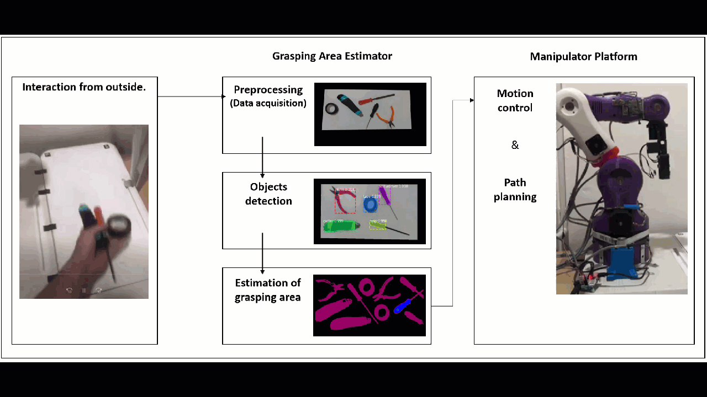

# Automated 3d printed robot arm for Pick & Place
This project is an applying of deep learning to robot arm for done some repetitive task. Fortunately, there is an Very cool! opensource 3d pritned robot arm and deep learning model called "MASK-RCNN" will be use in this case.

Note: this content include only overview/idea of the project. More detail will be provided later.

## Requirements
`Hardware`
1. BCN3D Moveo 3D printed robot arm
2. Arduino Mega 2560
3. Dynamixel servo motor (for gripper)
4. Intel Realsense depth camera D435

`Language`
1. Python
2. C++

`OS`
1. Ubuntu 18.04+ / Window10+

## Overview

`Note: To control robot arm movement, forward / inverse kinematics are required`

`Step-by-step`
1. Limit the workspace for safety and accuracy. In this case, AruCo marker was applied

2. Classification by MASK-RCNN

3. Use image processing techniques to find the target point that be able to pick it up, no obstacles around.

4. Find world coordinate of target point.

## Reference
Thank to these following list below, there are useful information and code I've implemented them for this project.
1. [matterport/MASK-RCNN for instance segmentation](https://github.com/matterport/Mask_RCNN)
2. [BCN3D-Moveo CAD/Manual step-by-step](https://github.com/BCN3D/BCN3D-Moveo)
3. [Opensource 3D CAD model gripper for robot arm](https://grabcad.com/library?page=2&time=all_time&sort=most_downloaded&tags=gripper)
